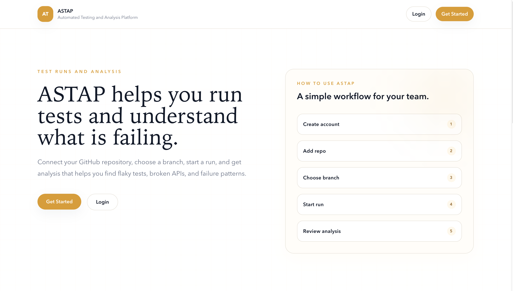
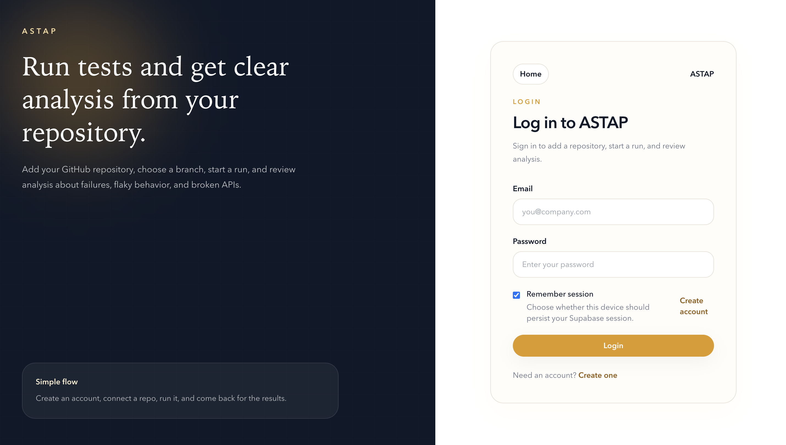
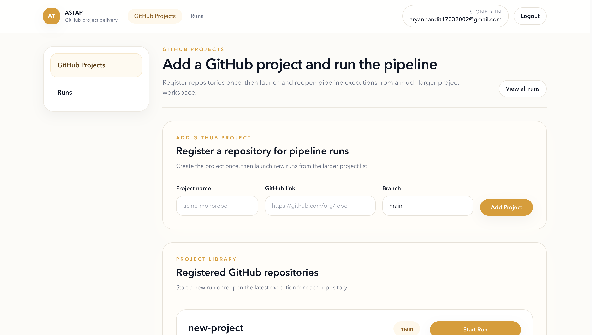
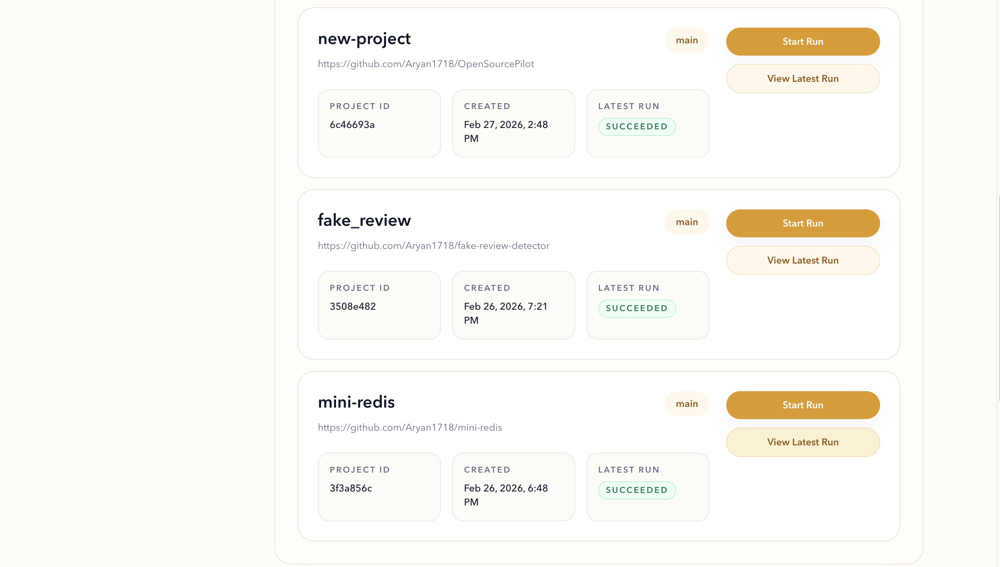
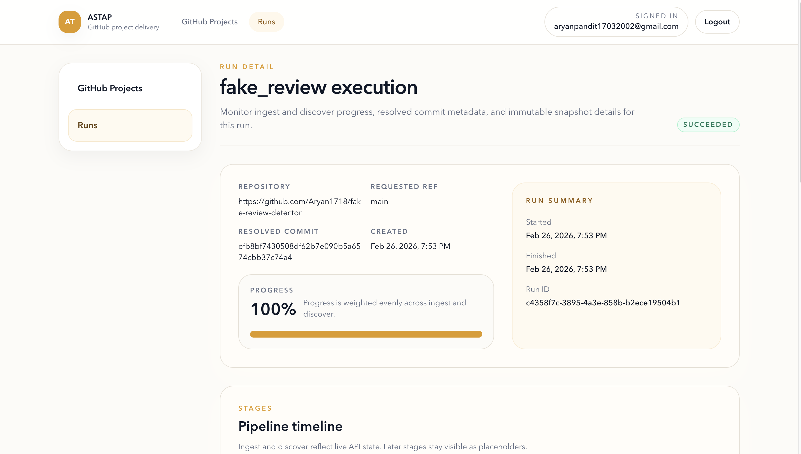
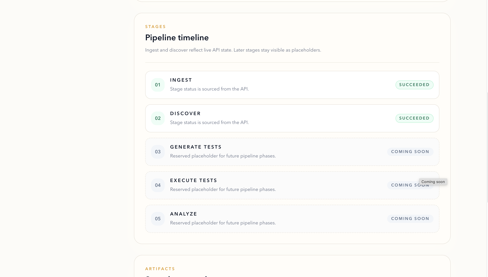
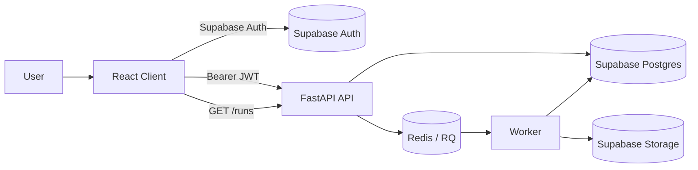

# ASTAP
## Automated Software Testing and Analysis Platform

[](https://www.python.org/)
[](https://fastapi.tiangolo.com/)
[](https://react.dev/)
[](https://redis.io/)
[](https://supabase.com/)

ASTAP is a production-oriented pipeline platform that ingests GitHub repositories, freezes immutable snapshots, discovers test targets, and exposes stage-level execution state through a secure API and web console.

## Table of Contents
- [Executive Summary](#executive-summary)
- [Current Product Status](#current-product-status)
- [Core Capabilities](#core-capabilities)
- [Application Screenshots](#application-screenshots)
- [Architecture](#architecture)
- [Data Model](#data-model)
- [Pipeline Lifecycle](#pipeline-lifecycle)
- [Security Model](#security-model)
- [Tech Stack](#tech-stack)
- [Quick Start](#quick-start)
- [Configuration](#configuration)
- [API Reference](#api-reference)
- [Artifacts and Storage](#artifacts-and-storage)
- [Operations and Reliability](#operations-and-reliability)
- [Deployment Notes](#deployment-notes)
- [Troubleshooting](#troubleshooting)
- [Limitations](#limitations)
- [Roadmap](#roadmap)
- [Contributing](#contributing)
- [Project Policies](#project-policies)
- [License](#license)

## Executive Summary
ASTAP is designed around a strict separation of concerns:
- Postgres is the single source of truth for runs, jobs, and targets.
- Redis is transport-only for job delivery.
- Supabase Storage is used for large immutable artifacts.
- Each pipeline stage runs independently in a clean temporary workspace and communicates through persisted state and artifacts.

This model enables predictable recovery, traceable execution, and clear stage boundaries for future expansion into test generation, isolated execution, and AI-driven analysis.

## Current Product Status
Implemented end-to-end:
- `ingest`
- `discover`

Defined and visible (not yet executed):
- `generate_tests`
- `execute_tests`
- `analyze`

## Core Capabilities
- Workspace-scoped multi-project model backed by Supabase Postgres + RLS
- Secure auth path using Supabase access tokens validated by API JWKS verification
- Run creation workflow that creates stage jobs and enqueues execution
- Atomic job claim mechanism (`pending -> running`) to prevent duplicate processing
- Immutable ingest snapshot generation with hash + size metadata
- Python AST-based discovery with idempotent target replacement
- Run timeline and progress visualization in the React UI
- Queue monitoring via RQ Dashboard

## Application Screenshots
### Landing Page


### Login Page


### Projects Page


### Run Detail - Overview


### Run Detail - Timeline


### Run Detail - Artifacts


## Architecture
### Logical Components
- `client` (React/Vite): signup/login, project registration, run launch, run details
- `api` (FastAPI): authenticated control plane for projects/runs and status retrieval
- `worker` (RQ): async stage executors (`ingest`, `discover`)
- `queue` (Redis): queue transport for stage jobs
- `rq-dashboard`: operator view into queue/job state
- `Supabase`: Postgres, Auth, Storage

### Runtime Flow
1. User authenticates with Supabase Auth from the client.
2. Client calls API with `Authorization: Bearer <access_token>`.
3. API validates JWT against Supabase JWKS and resolves user workspace.
4. API creates run + jobs in Postgres and enqueues ingest.
5. Worker performs stage work, persists state in Postgres, writes artifacts to Supabase Storage.
6. Client polls run endpoints for near-real-time status updates.

### System Diagram


## Data Model
Primary entities:
- `workspaces`
- `projects`
- `runs`
- `jobs`
- `targets`

Important invariants:
- `runs` is the lifecycle anchor for pipeline execution.
- `jobs` are unique by `(run_id, stage)`.
- `targets` are regenerated idempotently for each discover retry.
- Snapshot metadata is stored on `runs` and points to immutable storage objects.

## Pipeline Lifecycle
Stage sequence:
1. `ingest`
2. `discover`
3. `generate_tests`
4. `execute_tests`
5. `analyze`

### Ingest (Implemented)
- Clone repository
- Checkout requested ref
- Resolve commit SHA (`git rev-parse HEAD`)
- Produce archive snapshot (`git archive`)
- Upload snapshot to Supabase Storage
- Persist snapshot metadata to `runs`
- Mark ingest job succeeded and enqueue discover

### Discover (Implemented)
- Download and extract immutable snapshot
- Walk Python files and parse with built-in `ast`
- Detect:
  - `SERVICE_FUNCTION` for module-level functions and classes
  - `API_ENDPOINT` for FastAPI-like decorators (`get`, `post`, `put`, `delete`, `patch`)
- Replace existing run targets (`DELETE` + fresh `INSERT`)
- Upload `discover/targets.json`
- Mark discover succeeded and mark run succeeded

## Security Model
- Authentication: Supabase email/password in client
- Token transport: `Authorization: Bearer <access_token>`
- Token verification: server-side JWT validation with Supabase JWKS and issuer/audience checks
- Data isolation: Postgres Row Level Security policies scoped by workspace owner
- Artifact scope: private Supabase Storage bucket (`runs`)
- API scoping: all run/project reads and writes are constrained to current user workspace

## Tech Stack
- Backend: FastAPI, SQLAlchemy, Pydantic, PyJWT
- Worker: Python, RQ, Redis
- Frontend: React 18, TypeScript, Vite, Tailwind
- Data plane: Supabase Postgres + Storage + Auth
- Orchestration: Docker Compose

## Quick Start
### Prerequisites
- Docker and Docker Compose
- Supabase project
- `psql` CLI installed locally

### 1) Clone and configure environment
```bash
git clone <your-repo-url>
cd ASTAP
cp .env.example .env
```

Set values in `.env`:
- `DATABASE_URL`
- `REDIS_URL`
- `SUPABASE_URL`
- `SUPABASE_ANON_KEY`
- `SUPABASE_SERVICE_ROLE_KEY`
- `SUPABASE_DB_URL`
- `SUPABASE_STORAGE_BUCKET` (typically `runs`)
- `API_CORS_ORIGIN`

### 2) Apply Supabase migrations
```bash
./scripts/apply_supabase_schema.sh
```

### 3) Launch services
```bash
docker compose up --build
```

### 4) Access endpoints
- Client: `http://localhost:3000`
- API docs: `http://localhost:8000/docs`
- RQ Dashboard: `http://localhost:9181`

## Configuration
| Variable | Required | Description |
|---|---|---|
| `DATABASE_URL` | Yes | SQLAlchemy connection string for API/worker |
| `REDIS_URL` | Yes | RQ Redis URL |
| `SUPABASE_URL` | Yes | Supabase project base URL |
| `SUPABASE_ANON_KEY` | Yes | Public key used by frontend auth client |
| `SUPABASE_SERVICE_ROLE_KEY` | Yes | Service key used for storage operations |
| `SUPABASE_DB_URL` | Yes | Connection string used by migration scripts |
| `SUPABASE_STORAGE_BUCKET` | Yes | Artifact bucket name (`runs`) |
| `SUPABASE_JWT_AUDIENCE` | No | JWT audience (`authenticated` by default) |
| `API_CORS_ORIGIN` | No | Allowed CORS origin for API |
| `API_PORT` | No | API port override |
| `CLIENT_PORT` | No | Client port override |
| `RQ_DASHBOARD_PORT` | No | RQ dashboard port override |

## API Reference
### Health
- `GET /health`

### Projects
- `POST /projects`
- `GET /projects`

### Runs
- `POST /projects/{project_id}/runs`
- `GET /runs`
- `GET /runs/{run_id}`

### Execution semantics
- Creating a run inserts both `ingest` and `discover` jobs.
- API enqueues `ingest`.
- Worker enqueues `discover` only after successful ingest.
- Run progress is computed from stage statuses.

## Artifacts and Storage
Bucket:
- `runs` (private)

Path convention:
- `{workspace_id}/{project_id}/{run_id}/snapshot/snapshot.tar.gz`
- `{workspace_id}/{project_id}/{run_id}/discover/targets.json`

Snapshot metadata stored on run:
- `snapshot_bucket`
- `snapshot_key`
- `snapshot_sha256`
- `snapshot_size_bytes`
- `ref_resolved`

## Operations and Reliability
Reliability primitives currently active:
- Atomic job claiming in database
- Stage output persistence in Postgres
- Immutable artifact storage in Supabase
- Idempotent target persistence for discover retries

Monitoring and visibility:
- RQ Dashboard for queue/job state
- FastAPI `/docs` for API behavior verification
- Run detail UI with stage-level status and error rendering

Future reliability work:
- Reconciler-based continuation and lock TTL recovery is planned

## Deployment Notes
The repository ships with a local Docker Compose topology:
- `api`
- `worker`
- `queue`
- `rq-dashboard`
- `client`

For production environments:
- Use managed Redis and managed Postgres (Supabase)
- Externalize secrets via a secret manager
- Add centralized logging/metrics and alerting
- Run workers with horizontal scaling by queue/stage
- Introduce CI/CD checks for migrations and API contract tests

## Troubleshooting
### Migration script fails
- Confirm `psql` is installed.
- Validate `SUPABASE_DB_URL` in `.env`.
- Ensure migration user has privileges for schemas used (`public`, `storage`, `auth` where applicable).

### API returns `401 Invalid or expired token`
- Confirm frontend and backend target the same `SUPABASE_URL`.
- Re-authenticate to refresh session token.
- Verify `SUPABASE_JWT_AUDIENCE` if customized.

### Runs remain queued
- Check Redis connectivity from `api` and `worker`.
- Confirm worker is running and subscribed to `ingest` and `discover` queues.
- Inspect job failures in RQ dashboard and API run detail.

### Discover fails on repository parsing
- Ensure repository snapshot contains valid Python files.
- Review run detail stage error and worker logs for syntax/encoding issues.

## Limitations
- Discovery currently supports Python only.
- Discover skips `tests/` and common virtual/build/vendor directories.
- Reconciler loop is currently a stub.
- Stages after discover are placeholders in this version.

## Roadmap
- Implement reconciler and lock timeout recovery
- Add `generate_tests` stage with model-driven test synthesis
- Add isolated `execute_tests` stage
- Add `analyze` stage with diagnostics and summaries
- Add downloadable artifact management in UI
- Extend discovery to additional languages and frameworks

## Contributing
See [CONTRIBUTING.md](CONTRIBUTING.md) for full contribution workflow and PR expectations.

## Project Policies
- [Code of Conduct](CODE_OF_CONDUCT.md)
- [Security Policy](SECURITY.md)
- [Support Guide](SUPPORT.md)
- [Terms and Conditions](TERMS_AND_CONDITIONS.md)

## License
This project is licensed under the [MIT License](LICENSE).
