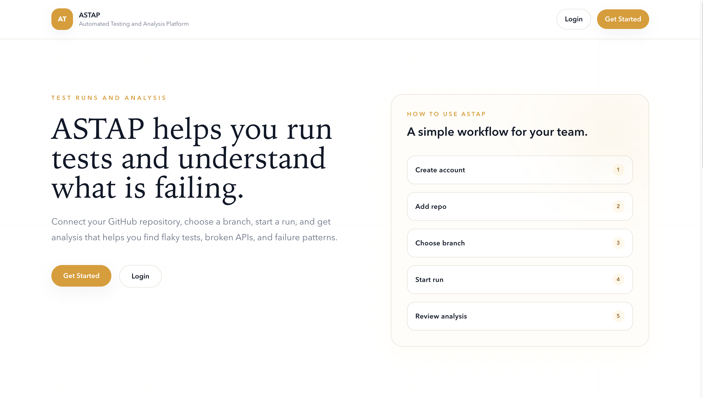
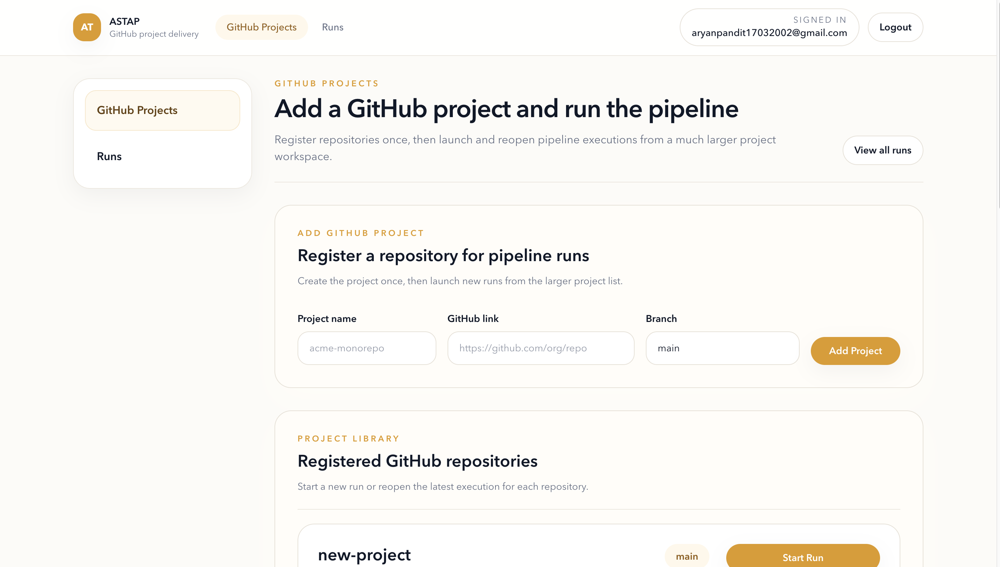
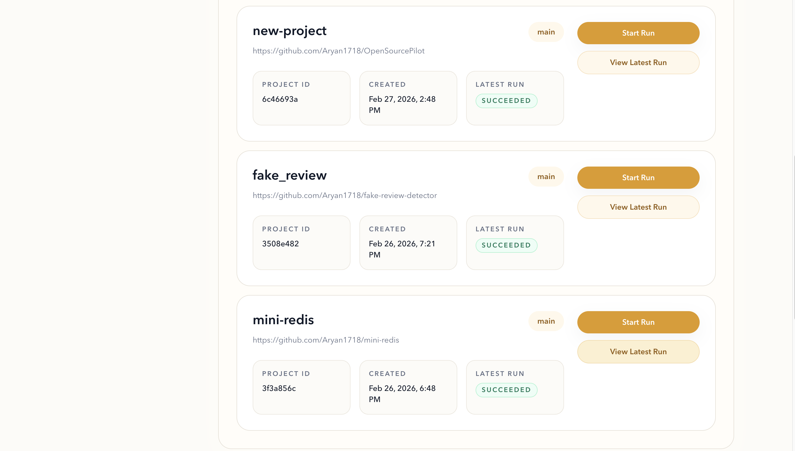
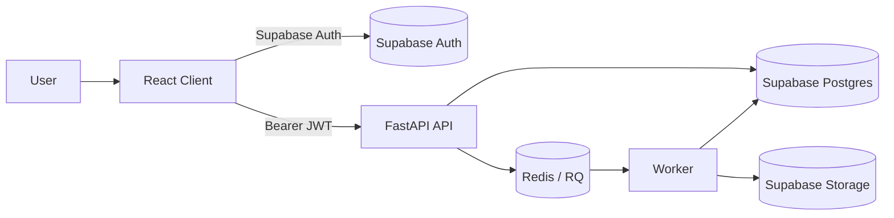

# ASTAP

> Automated Software Testing and Analysis Platform

[](https://www.python.org/)
[](https://fastapi.tiangolo.com/)
[](https://react.dev/)
[](https://supabase.com/)
[](https://redis.io/)

ASTAP is a pipeline-oriented platform for cloning GitHub repositories, freezing immutable snapshots, discovering Python test targets, generating AI-authored pytest files, and surfacing run progress through a web UI.

It is designed around one strict rule: Postgres is the source of truth. Redis is used only for job delivery, and large artifacts live in Supabase Storage.

> [!IMPORTANT]
> The current implementation fully supports `ingest`, `discover`, and `generate_tests`. The `execute_tests` and `analyze` stages are defined in the architecture but are not implemented yet.

## Features

- Immutable snapshot per run using `git archive`
- Stage-based pipeline with explicit `runs` and `jobs`
- Atomic job claiming to avoid duplicate execution
- Python AST-based target discovery
- FastAPI endpoint detection for API target generation
- OpenAI-powered pytest generation for supported targets
- Supabase-backed auth, database, and artifact storage
- React dashboard for projects, runs, timelines, artifacts, and generated tests
- Docker Compose setup for local development

## Screenshots

| Landing | Projects | Run Detail |
|---|---|---|
|  |  |  |

More UI snapshots are available in [`docs/assets`](docs/assets).

## Architecture

ASTAP is split into five runtime surfaces:

- `client`: React + Vite frontend
- `api`: FastAPI control plane
- `worker`: RQ workers for async pipeline stages
- `queue`: Redis transport
- `Supabase`: Postgres, Auth, and Storage


```mermaid
flowchart LR
  U[User] --> C[React Client]
  C -->|Supabase Auth| SA[(Supabase Auth)]
  C -->|Bearer JWT| API[FastAPI API]
  API --> DB[(Supabase Postgres)]
  API --> RQ[(Redis / RQ)]
  RQ --> W[Worker]
  W --> DB
  W --> ST[(Supabase Storage)]
```

### Pipeline

1. `ingest`: clone repo, resolve commit SHA, build immutable snapshot, upload artifact
2. `discover`: extract snapshot, parse Python code with `ast`, persist targets, upload `targets.json`
3. `generate_tests`: rehydrate discovered targets, call OpenAI, store generated pytest files and manifest
4. `execute_tests`: planned
5. `analyze`: planned

## Repository Layout

```text
.
├── api/               FastAPI application
├── client/            React frontend
├── worker/            RQ jobs and providers
├── shared/            Shared DB, schema, queue, storage, and target logic
├── migrations/        SQL schema and target-model migrations
├── scripts/           Local and Supabase schema helpers
├── tests/             Backend test coverage
└── docker-compose.yml Local runtime stack
```

## Quick Start

### Prerequisites

- Docker and Docker Compose
- A Supabase project
- `psql` for applying schema scripts
- An OpenAI API key if you want to run `generate_tests`

### 1. Configure environment

```bash
cp .env.example .env
```

Set at least these values in `.env`:

- `DATABASE_URL`
- `REDIS_URL`
- `SUPABASE_URL`
- `SUPABASE_ANON_KEY`
- `SUPABASE_SERVICE_ROLE_KEY`
- `SUPABASE_DB_URL`
- `SUPABASE_STORAGE_BUCKET`
- `OPENAI_API_KEY` for test generation

### 2. Apply database schema

For Supabase:

```bash
./scripts/apply_supabase_schema.sh
```

For a local Postgres instance:

```bash
./scripts/apply_local_schema.sh
```

### 3. Start the stack

```bash
docker compose up --build
```

### 4. Open the app

- Client: `http://localhost:3000`
- API docs: `http://localhost:8000/docs`
- RQ dashboard: `http://localhost:9181`

## Configuration

The main runtime configuration is defined in [shared/config.py](shared/config.py).

| Variable | Purpose |
|---|---|
| `DATABASE_URL` | SQLAlchemy connection string for API and worker |
| `REDIS_URL` | Redis connection used by RQ |
| `SUPABASE_URL` | Supabase project URL |
| `SUPABASE_ANON_KEY` | Frontend auth key |
| `SUPABASE_SERVICE_ROLE_KEY` | Worker/API access for storage operations |
| `SUPABASE_DB_URL` | Database URL used by schema scripts |
| `SUPABASE_STORAGE_BUCKET` | Private artifact bucket, typically `runs` |
| `API_CORS_ORIGIN` | Allowed frontend origin |
| `OPENAI_API_KEY` | Required when `generate_tests` runs |
| `GENERATE_TESTS_MODEL` | LLM used for pytest generation |
| `GENERATE_TESTS_MAX_TARGETS_PER_RUN` | Soft cap on generated targets per run |
| `GENERATE_TESTS_ENABLE_SERVICE_FUNCTIONS` | Enable unit-style target generation |
| `GENERATE_TESTS_ENABLE_API_ENDPOINTS` | Enable API endpoint generation |

## How a Run Works

When a user starts a run:

1. The API creates a `run` row and stage `job` rows.
2. `ingest` is enqueued in Redis.
3. The worker claims the job atomically in Postgres.
4. Each stage reads inputs from Postgres and Supabase Storage, works in a clean temporary directory, then writes results back.
5. The frontend polls the API for run status, progress, artifacts, and generated test output.

> [!NOTE]
> Snapshots are immutable. Later stages always operate on the archived snapshot, never directly on GitHub.

## Generated Test Output

The current implementation writes generated artifacts to storage under the run prefix, including:

- `snapshot/snapshot.tar.gz`
- `discover/targets.json`
- `generated_tests/test_index.json`
- per-target generated pytest files
- `generated_tests.zip`

The frontend exposes both a manifest view and per-file code viewer for generated tests.

## API Surface

The main endpoints currently exposed by the API are:

- `POST /projects`
- `GET /projects`
- `DELETE /projects/{project_id}`
- `POST /projects/{project_id}/runs`
- `GET /runs`
- `GET /runs/{run_id}`
- `GET /runs/{run_id}/generated-tests/manifest`
- `GET /runs/{run_id}/generated-tests/tree`

Interactive API docs are available at `/docs` when the API is running.

## Development

Backend tests:

```bash
pytest
```

Frontend tests:

```bash
cd client
npm test
```

Frontend dev server:

```bash
cd client
npm run dev
```

## Current Scope

ASTAP is already usable for repository ingestion, Python target discovery, and AI-based test generation, but it is still an MVP. The next major milestones are:

- test execution in isolated environments
- post-run analysis and summarization
- stronger reconciliation and crash recovery workflows
- broader language and framework support
